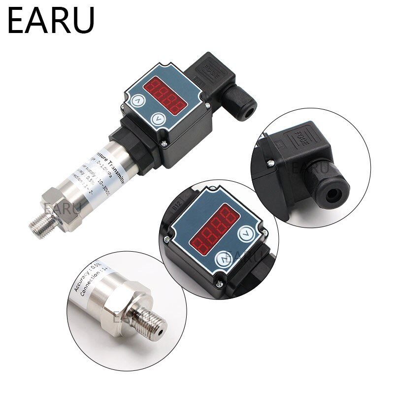

# **Smart Irrigation System**
***
## **Contentes** 
1. *Introduction*
2. *Project discription*
3. *Devices in the project*
4. *Photos*

---
## ***Introduction***
This is my frist project to client 
The main purpose of this project is to monitor and control the resources of a company that distribute large amountes of water to the farmers to irrigate there lands 

The main source of the water is 13km away from the distribution area and also the mangement location that wants the data 
Water is pumbed throuth this long distance 

After the water is arrived it distribute through three large main pipes 

each pipe has more then 20 very large tanks vary from 200 m3 to 500m3 , each pipe has one flowmeter , one pressure sensor

 

***
 

## ***Project discription***
 

  

This project is based on ***Atmega2560*** MCU and ***Ethernet module W5500*** 

The board acting as a **webserver** connected to two *nanostation devices* to be able to transmit the data through the long distance 

The main PC has a *Desktop application written in **flutter** to interact with the boards this show the data on a GUI*

Data is collectet from the TUF-2000 and the sensors , then send it if the main pc send an ***HTTP GET request*** to the the board

The request could also control the relays on the board 

The PCB was designed in **KICAD**

  

Then manufacturing in *china* and assemplied  in *Egypt*

  

 

***
 

## ***Devices in the project***
 

#### **1 TUF-2000 Ultrasonic Flowmeter**
Each large pipe will have a *TUF-2000* ultra sonic flowmeter
this device works with *modebus RTU* that based on *RS485* protocol

  

This device is able to measure many properties of any fluid 
The *TUF-2000P* flow meter can be virtually applied to a wide range of measurements. The measured pipe ranges 15-6000mm. Because the instrument and transducers are non-contacting and have no moving parts; the flow meter can
not be affected by system pressure, fouling or wear. Standard transducers are rated
to 110 ºC.

  

*Manual* [here](https://images-na.ssl-images-amazon.com/images/I/91CvZHsNYBL.pdf)
for more info.

 

---
#### **2 HYXC-MP Pressure sensor**
HYXC is a pressure sensor that placedin any pipe and get the internal pressure then output the value 4-20mah with linear relaion with its max pressue value .

  

 

---
 

#### **3 Pressure sensor**
Another type of Pressure sensors , it also placed in a hole in the pipe , the transmit the output to the controller
pressue value .

  

 

---
 

#### **4 Levelmeter sensor**
This sensor is used to calculate the water depth in large tanks up to 10 meters .
pressue value .

  

 
----
 

### **Photos**

  
  
  
  

